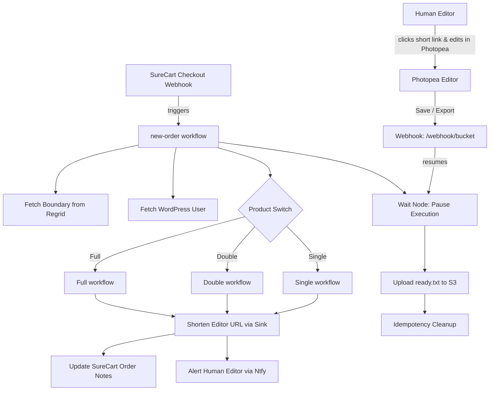

# BrokerTricks n8n-as-code Workspace

This repository contains the `n8n-as-code` workflows for the **BrokerTricks** automation pipeline. It manages customer orders, integrates parcel boundaries from Regrid, generates Photopea configuration URLs, and handles human-in-the-loop image editing workflows.

---

## 🏗️ Repository Architecture

The primary entry point is the **`new-order`** workflow, which orchestrates subworkflows based on the product purchased, then pauses for human editing before final delivery.



---

## 📁 Core Workflows

All workflow definitions are located in the [workflows/brokertricks](file:///home/user/Repositories/n8n-as-code/workflows/brokertricks) directory:

### 1. Primary Orchestrators & Product Workflows
*   **[new-order.workflow.ts](file:///home/user/Repositories/n8n-as-code/workflows/brokertricks/new-order.workflow.ts)**: Orchestrates the order intake. Gathers geo/KML data, coordinates the product subworkflow execution, pauses on a `Wait` node for human editor input, and finalizes the order once the callback is received.
*   **[Full.workflow.ts](file:///home/user/Repositories/n8n-as-code/workflows/brokertricks/Full.workflow.ts)**: Workflow for the "Full" listing pack. Sets up the full Photopea editor configuration including background reference images and an ExtendScript script.
*   **[Overhead-North.workflow.ts](file:///home/user/Repositories/n8n-as-code/workflows/brokertricks/Overhead-North.workflow.ts)**: Workflow for the "Overhead North" pack. Prepares specific north-oriented images.
*   **[Overhead-Only.workflow.ts](file:///home/user/Repositories/n8n-as-code/workflows/brokertricks/Overhead-Only.workflow.ts)**: Workflow for the "Overhead Only" pack. Prepares basic boundary/overhead maps.

### 2. Operations & Utility Workflows
*   **[Fulfill.workflow.ts](file:///home/user/Repositories/n8n-as-code/workflows/brokertricks/Fulfill.workflow.ts)**: Listens for fulfillment events to mark items as fulfilled in SureCart.
*   **[cookie.workflow.ts](file:///home/user/Repositories/n8n-as-code/workflows/brokertricks/cookie.workflow.ts)**: Handles session/authentication cookie state management.
*   **[Idempotency Manage.workflow.ts](file:///home/user/Repositories/n8n-as-code/workflows/brokertricks/Idempotency%20Manage.workflow.ts)**: Ensures order processing remains idempotent to avoid double-processing checkouts.
*   **[get-parcel-to-checkout.workflow.ts](file:///home/user/Repositories/n8n-as-code/workflows/brokertricks/get-parcel-to-checkout.workflow.ts)**: Helper to fetch parcel boundary attributes during checkout flow.
*   **[MigrateDB.workflow.ts](file:///home/user/Repositories/n8n-as-code/workflows/brokertricks/MigrateDB.workflow.ts)**: Utility for database structure migrations.

---

## 🤝 Human-In-The-Loop (HITL) Flow

A key component of this pipeline is the transition from automated processing to manual human design:

1. **Shortened URL**: To bypass header size limits, the massive Photopea editor state URL is shortened using the Cloudflare-based **Sink Link Shortener** (`https://link.brokertricks.com`).
2. **Notification**: The shortened link is sent to human editors via `ntfy.sh` (topic `to-human-bt-test`).
3. **Wait State**: The `new-order` execution halts at the `Wait` node.
4. **Editor Action**: The human editor uses the link to open the pre-configured Photopea window, does the visual adjustments, and saves the file.
5. **Webhook Callback**: Saving in Photopea fires a POST request to `/webhook/bucket`, which tells the `Wait` node to resume.
6. **Completion**: A `ready.txt` file is placed in S3 (`cust_<customer>/order_<order>/ready.txt`) as a trigger for client delivery.

---

## 🛠️ Commands & Sync Discipline

Always interact with the environment from the **workspace context root** (`/home/user/Repositories/n8n-as-code`).

### Check Environment Status
```bash
npx --yes n8nac env status --json
```

### Sync Workflows with n8n Instance
*   **List Workflows**:
    ```bash
    npx --yes n8nac list
    ```
*   **Pull Remote Changes** (always run before editing locally):
    ```bash
    npx --yes n8nac pull <workflowId>
    ```
*   **Push Local Changes** (always run after modifying):
    ```bash
    npx --yes n8nac push workflows/brokertricks/<name>.workflow.ts --verify
    ```
*   **Validate Local Syntax**:
    ```bash
    npx --yes n8nac skills validate workflows/brokertricks/<name>.workflow.ts
    ```
